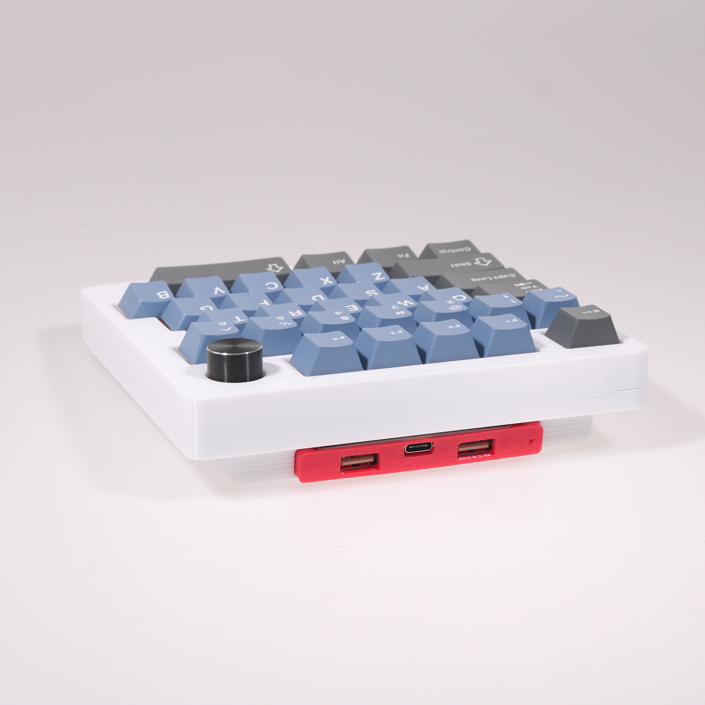
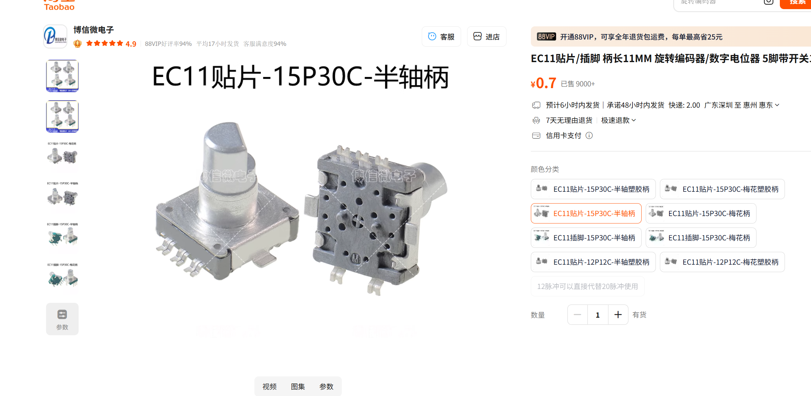

左手游戏键盘+1旋钮

两个版本，一个带两个USB2.0HUb，一个不带HUB

USB2.0 HUB可以插接收器使用，建议插主键盘和鼠标的接收器，然后，弄个键盘支架将这个游戏键盘立起来

快捷键：
|按键|触发|备注|
|-|-|-|
|FN+ALT+Lsft	|打开/关闭RGB
|FN+ALT+Z	    |切换灯效
|FN+ALT+S	    |饱和度+
|FN+ALT+X	    |饱和度-
|FN+ALT+D	    |颜色+
|FN+ALT+C	    |颜色-
|FN+ALT+F	    |亮度+   
|FN+ALT+V	    |亮度-
|FN+ALT+G	    |灯效速度+
|FN+ALT+B	    |灯效速度-
|FN+ALT+tab	    |打开/关闭全键无冲	|默认开启全键无冲
|FN+ALT+ESC	    |恢复出厂设置	
|FN+ALT+Mute	|进入bootloader	|Mute为旋钮位或者F5

[淘宝店铺地址：](https://item.taobao.com/item.htm?ft=t&id=827106189521&sku_properties=5919063%3A3266779%3B122216346%3A21959%3B122216808%3A79550452)

[外壳模型地址：](https://makerworld.com/zh/models/1734221-left-hand-gaming-keyboard-case-r3#profileId-1842331)

